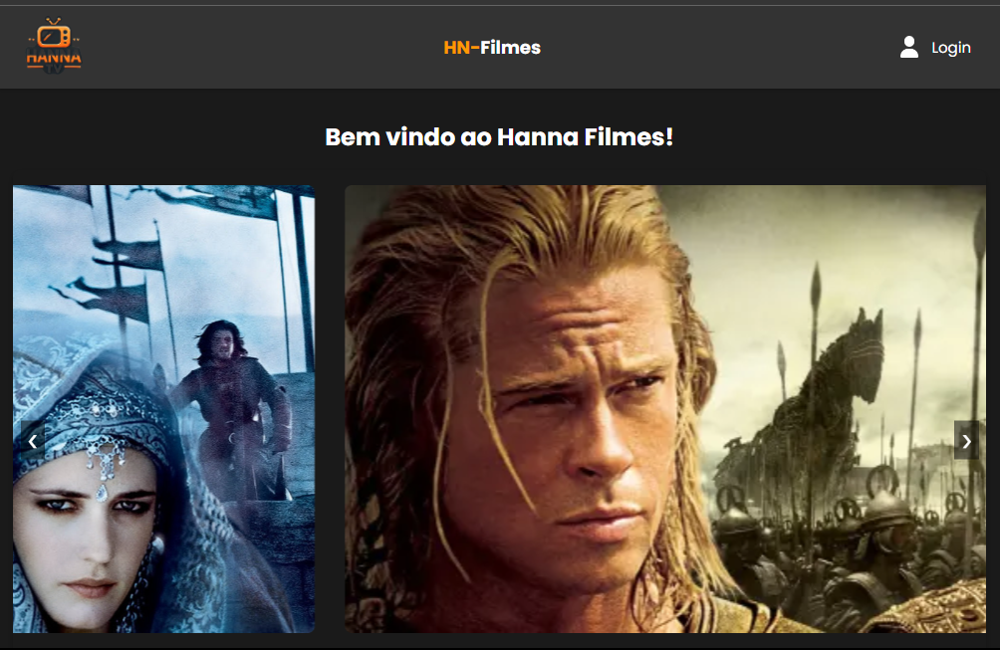
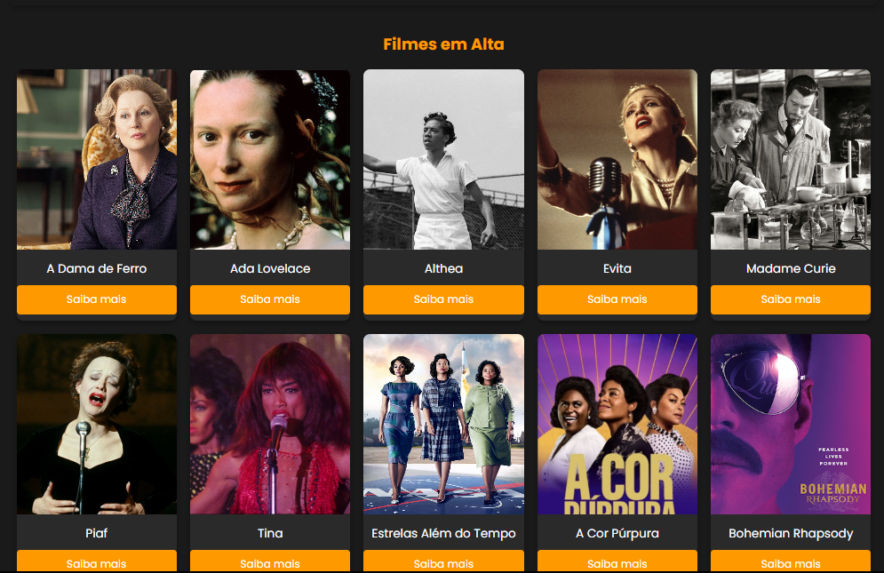

<!DOCTYPE html>
<html lang="pt-br">
<head>
    <meta charset="UTF-8">
    <meta name="viewport" content="width=device-width, initial-scale=1.0">
    <meta name="description" content="Projeto Meus Filmes">
    <meta name="keywords" content="Filmes, Responsivo, SCSS, Gulp, Visual Studio Code">
    <meta name="author" content="Ana Alice Rodrigues">
    
</head>
<body>

<header>
    <h1>Meus Filmes</h1>
    
    
</header>

    
Índice

    <ol>
        <li><a href="#sobre-o-projeto">Sobre o projeto</a></li>
        <li><a href="#parte-tecnica">Parte Técnica</a></li>
        <li><a href="#estrutura-dos-arquivos">Estrutura dos Arquivos</a></li>
        <li><a href="#casos-de-uso">Casos de Uso</a></li>
        <li><a href="#ferramentas">Ferramentas</a></li>
        <li><a href="#contato">Contato</a></li>
    </ol>

<section id="sobre-o-projeto">
    <h2>Sobre o projeto</h2>
    
"Meus Filmes" é um projeto web desenvolvido para exibir uma lista de filmes populares, utilizando um layout responsivo e moderno. O projeto inclui um carrossel de filmes, uma grade de filmes populares e uma interface de usuário amigável que se adapta a diferentes tamanhos de tela. O objetivo principal do projeto é proporcionar uma experiência de usuário agradável e eficiente para quem deseja explorar filmes.

    
Proposta de Valor: Oferecer uma experiência de navegação conveniente, com uma seleção diversificada de filmes, facilidade de navegação e processos de visualização eficientes.

</section>

<section id="parte-tecnica">
    <h2>Parte Técnica</h2>
    <ul>
        <li>SCSS: Utilização de variáveis, aninhamento, mixins e funções para criar estilos CSS mais organizados e reutilizáveis.</li>
        <li>Gulp: Automação de tarefas repetitivas como compilação de SCSS, minificação de arquivos CSS/JS e otimização de imagens, aumentando a eficiência do fluxo de trabalho.</li>
        <li>Design Responsivo: Técnicas para criar layouts que se adaptam bem a diferentes tamanhos de tela, melhorando a experiência do usuário em diversos dispositivos.</li>
        <li>Organização de Projeto: Manutenção de uma estrutura de arquivos organizada e seguindo boas práticas de desenvolvimento.</li>
    </ul>
</section>

<section id="estrutura-dos-arquivos">
    <h2>Estrutura dos Arquivos</h2>
    
A estrutura do projeto é organizada de maneira a manter o código limpo e modular. Os principais diretórios incluem:

    <ul>
        <li><strong>dist/</strong>: Arquivos compilados e otimizados para produção.</li>
        <li><strong>src/</strong>: Código fonte incluindo SCSS, JS e HTML.</li>
        <li><strong>gulpfile.js</strong>: Configurações do Gulp para automação de tarefas.</li>
        <li><strong>package.json</strong>: Gerenciamento de dependências do projeto.</li>
    </ul>
</section>

<section id="casos-de-uso">
    <h2>Casos de Uso</h2>
    <ul>
        <li>Visualizar filmes populares em um carrossel interativo.</li>
        <li>Explorar uma grade de filmes populares com informações básicas.</li>
        <li>Navegar em um site responsivo que se adapta a diferentes dispositivos.</li>
    </ul>
</section>

<section id="ferramentas">
    <h2>Ferramentas</h2>
    <ul>
        <li></li>
        <li></li>
        <li></li>
        <li></li>
        <li></li>
        <li></li>
    </ul>
</section>

<section id="contato">
    <h2>Contato</h2>
    <ul>
        <li></li>
        <li></li>
    </ul>
    
Acesse o projeto na Vercel

</section>

</body>
</html>
